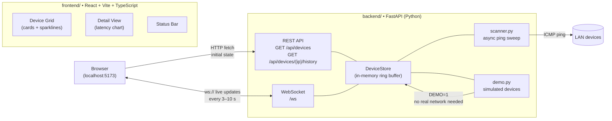
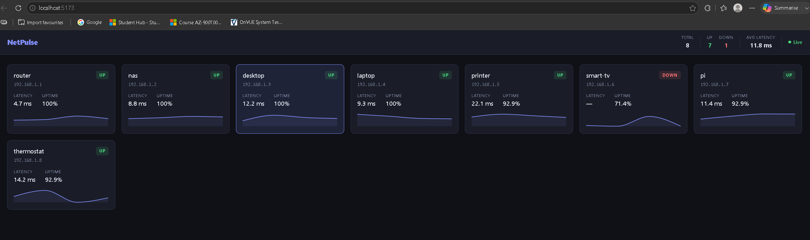

# NetPulse

Real-time LAN monitoring dashboard — discovers devices on your network, tracks latency and uptime, and streams live updates to a browser UI with no refresh needed.

---

## Architecture



---

## Screenshot



---

## Running in Demo Mode

Demo mode runs 8 simulated devices with realistic latency, jitter, and occasional outages. No real network or admin rights required.

**Terminal 1 — backend**

```powershell
cd C:\Projects\netpulse
$env:DEMO="1"
python -m uvicorn backend.main:app --reload
```

**Terminal 2 — frontend**

```powershell
cd C:\Projects\netpulse\frontend
npm run dev
```

Open **http://localhost:5173**. Devices update every 3 seconds. Click any card to open the full latency history chart.

---

## Running Against a Real Network

Requires the ability to send ICMP pings (administrator / root on most systems).

```powershell
# Windows (run terminal as Administrator)
cd C:\Projects\netpulse
$env:SUBNET="192.168.1.0/24"   # adjust to your network
$env:INTERVAL="10"              # poll interval in seconds
python -m uvicorn backend.main:app --reload
```

On Linux / macOS:

```bash
SUBNET=192.168.1.0/24 INTERVAL=10 python -m uvicorn backend.main:app --reload
```

The backend performs one ping sweep of the subnet on startup to discover live hosts, then polls every known device on the configured interval.

---

## What Demo Mode Is For

`DEMO=1` bypasses all network I/O and instead generates 8 fake devices (`router`, `nas`, `desktop`, `laptop`, `printer`, `smart-tv`, `pi`, `thermostat`). Each device has a configured base latency and jitter drawn from a Gaussian distribution, plus a per-device outage probability that randomly produces `null` samples (shown as line breaks in the chart). This lets you develop, demo, or test the full UI on any machine — a laptop with no LAN access, a CI runner, a live demo — without touching the network or requiring elevated privileges.

---

## Backend API

| Endpoint | Description |
|---|---|
| `GET /api/devices` | All known devices — IP, hostname, status (`up`/`down`), last latency, uptime % |
| `GET /api/devices/{ip}/history` | Full latency history (last 100 samples) for one device |
| `WS /ws` | Push stream of `{"type": "update"|"status_change", "device": {...}}` messages |

---

## Tests

**46 pytest tests** — run from the repo root:

```powershell
python -m pytest -v
```

Coverage:

| Suite | What it tests |
|---|---|
| `test_status.py` | Ping output parsing (Windows + Linux formats), `DeviceRecord` status transitions, uptime calculation, 100-sample ring buffer cap, `DeviceStore` CRUD and change-detection |
| `test_demo.py` | `generate_sample` invariants (floor, outage probability, Gaussian distribution), demo device config (8 devices, unique IPs/hostnames), WebSocket message contract |

---

## Project Layout

```
netpulse/
├── backend/
│   ├── models.py       # Pydantic models
│   ├── scanner.py      # async ping sweep + DeviceStore + monitoring loop
│   ├── demo.py         # simulated device generator
│   ├── main.py         # FastAPI app (REST + WebSocket)
│   └── tests/
│       ├── test_status.py
│       └── test_demo.py
├── frontend/
│   ├── src/
│   │   ├── hooks/useDevices.ts      # WebSocket subscriber + sparkline buffer
│   │   ├── components/
│   │   │   ├── StatusBar.tsx
│   │   │   ├── DeviceGrid.tsx
│   │   │   ├── DeviceCard.tsx
│   │   │   ├── Sparkline.tsx
│   │   │   └── DetailView.tsx
│   │   ├── types.ts
│   │   └── App.tsx
│   └── vite.config.ts
├── docs/
│   └── screenshot.png
└── requirements.txt
```

---

## Requirements

- Python 3.11+
- Node.js 18+
- `pip install -r requirements.txt` (fastapi, uvicorn, pytest)
- `cd frontend && npm install` (react, recharts, vite, typescript)
